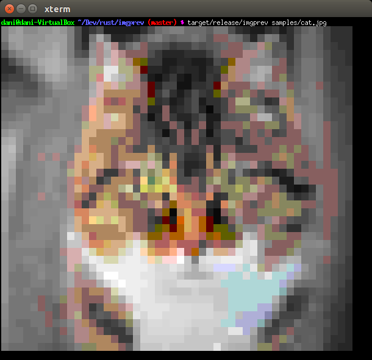
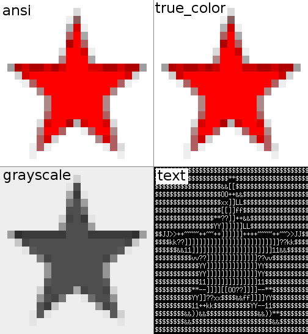
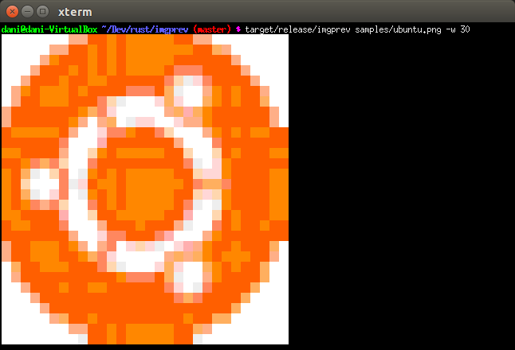
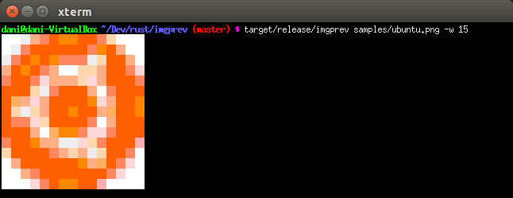

# Image previewer (imgprev)

## Summary

A simple and powerful [Rust](https://www.rust-lang.org) [CLI](https://en.wikipedia.org/wiki/Command-line_interface) application to display images in non visual interfaces (for example, ssh).

## Install

You can download the binary files from the releases section, or build it by yourself with Rust. After that, place the binary file in a directory accessible by *PATH* (e.g. in */usr/bin/*). Otherwise, you may want to put the executable in any folder, and prefix the executable with corresponding directory path (e.g. */home/test/dev/imgprev*).

Please bear in mind that this application must be installed in the target machine if you are ussing ssh.

## Usage

Once installed, you can use the program within your favourite command line:

```sh
imgprev path/to/my/image/cat.jpg
```

Which should output something like this:



Cute, isn't it? Now, you can preview images in a non-GUI enviroment without downloading the file!

By default, the image will be scalated to fit into the console (around 100 columns wide).

To know more about the available options, use

```sh
imgprev --help
```

or check the [Options](#options) section of this file.

### Supported formats

These are the image extensions supported by this application:

- [Portable Network Graphics](https://es.wikipedia.org/wiki/Portable_Network_Graphics) (png)
- [Joint Photographic Experts Group](https://en.wikipedia.org/wiki/JPEG) (jpeg, jpg, jpe, jif, jfif, jfi)
- [Graphics Interchange Format](https://en.wikipedia.org/wiki/GIF) (gif)
- [Windows Bitmap](https://es.wikipedia.org/wiki/Windows_bitmap) (bmp, dib)
- [ICO](https://en.wikipedia.org/wiki/ICO_%28file_format%29) (ico)
- [Tagged Image File Format](https://en.wikipedia.org/wiki/TIFF) (tiff, tif)
- [WebP](https://en.wikipedia.org/wiki/WebP) (webp)

### Options

#### Render mode

Used with the `-m` or `--mode` option.

Multiple render modes are supported for this application. The following table summarizes them:

| Name | Description |
| ---- | ----------- |
| ansi | Use ansi colors (256) to render the image. This is the default mode. |
| grayscale | Same as ansy, but using grayscale colors. |
| true_color | Use true color mode (rgb). Not supported in many terminals. |
| text | Use ascii characters to represent the image. Ideal for simple terminals without color support. |

For example, the same image in different modes:



And, as a bonus, a cat in ascii :

#### Max width

Used with the `-w` or `--width` option; it sets the maximum width to fit the image. Each image pixel equals to 2 console characters. Use any value greater than 0.

For example, two different outputs for different sizes. With max width 30:

```sh
$ imgprev samples/ubuntu.png -w 30
```

which will output this:



while this, with max width 15:

```sh
$ imgprev samples/ubuntu.png -w 15
```

will output this:



#### Resize filter

Used with the `-f` or `--filter` option.

This application allow to use multiple resize filters or algorithms:

- **none**: Use the nearest neighbour (pixel).
- **linear**: Create a linear interpolation between pixels.
- **cubic**: Create a cubir interpolation between pixels
- **gaussian**: Use a gaussian function to compute the pixel's value.
- **lanczos3**: Lanczos algorithm with window's size 3.

Here is a example of the available filters for a single image (in true color):


## Development

### Dependencies

This project was developed using *Rust v1.11.0*. It uses the following crates:

- [image](https://github.com/PistonDevelopers/image): Image file handling for Rust.
- [lazy_static](https://github.com/rust-lang-nursery/lazy-static.rs): Lazy initialization for static references.
- [clap-rs](https://github.com/kbknapp/clap-rs): A powerful library to create CLI applications.

### Build

Clone this repository and install it with:

```sh
git clone https://github.com/wikiti/imgprev.git
cd imgprev
cargo build --release
target/release/imgprev examples/ubuntu.png
```

### Run tests

Use cargo to run unit tests:

```sh
cargo test
```

## Authors

This project has been developed by:

| Avatar | Name | Nickname | Email |
| ------- | ------------- | --------- | ------------------ |
|   | Daniel Herzog | Wikiti | [info@danielherzog.es](mailto:info@danielherzog.es) |
